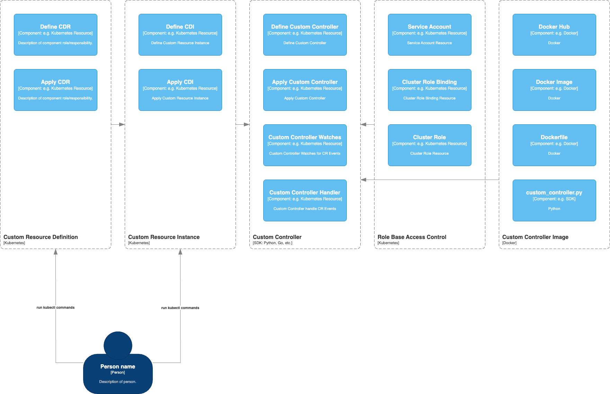
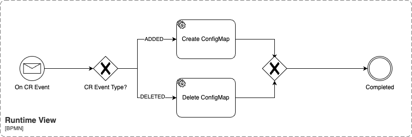

# Custom Resource Definition

CRDs allow you to define your own custom resources, extending the Kubernetes API to fit your specific needs. 
In this blog post, we’ll walk through a practical example of how CRDs work, using a custom controller to manage ConfigMaps based on custom resources.

## Why?

CRDs are incredibly powerful because they enable you to represent and manage application-specific resources in a Kubernetes-native way. 
Here are some reasons why you might want to use CRDs:

* Abstraction: CRDs allow you to abstract away complex logic into custom resources, making it easier to manage and interact with your applications.
* Consistency: By defining custom resources, you ensure that your applications are consistently managed across different environments.
* Automation: CRDs enable automation by allowing you to define custom controllers that can watch and reconcile the state of custom resources.

## Prerequisites

Before we begin, ensure you have the following:

* Basic understanding of Kubernetes
* Kubernetes cluster with kubectl installed
* Docker (Building Controller Image)

## Context & Scope



### **Context of Kubernetes Custom Resource Definitions (CRDs):**

1. **Custom Resource Definition (CRD):** 
   - CRDs allow you to extend the Kubernetes API with new resource types. This is the starting point in the diagram, where the CRD is defined and applied through `kubectl` commands.
   - **Define and Apply CDR:** In this section, a Custom Resource Definition (CDR) is defined and applied, establishing the blueprint for the custom resource in Kubernetes.

2. **Custom Resource Instance:**
   - Once a CRD is defined, you create instances of this custom resource, which is referred to as Custom Resource Instance (CDI).
   - The user interacts with the Kubernetes API through `kubectl` to define and apply custom resource instances based on the CRD.

3. **Custom Controller:**
   - A custom controller watches for events related to the custom resources (CR) and takes appropriate actions. The diagram shows multiple steps involved in creating, watching, and handling custom controllers.
   - The custom controller logic is usually implemented in SDKs such as Python or Go. It monitors the CRs and performs tasks based on the desired state.

4. **Role-Based Access Control (RBAC):**
   - Access to the resources and controllers is managed using Kubernetes RBAC policies. Role bindings, service accounts, and cluster roles are defined to control access to various Kubernetes resources.
   - The diagram highlights how the access control components are tied together with the service account, role binding, and cluster roles.

5. **Custom Controller Image:**
   - The custom controller's functionality is encapsulated in a Docker image. This part of the diagram showcases how the Docker components are utilized to package and distribute the custom controller, including the Dockerfile, Docker image, and code (`custom_controller.py`).
   - Docker Hub is used for image distribution, making the custom controller deployable across different Kubernetes clusters.

### **Scope of the Diagram:**

This diagram represents the full lifecycle of defining and managing Kubernetes custom resources. The scope includes:

- **Resource Definitions:** Establishing new resource types (CRD).
- **Instance Creation:** Managing instances of custom resources.
- **Custom Controllers:** Automating the management of these custom resources via custom controllers.
- **Access Controls:** Using RBAC to secure access.
- **Packaging and Deployment:** Using Docker for packaging and deploying the controller.

## Runtime View



### **Context of the Runtime View for Custom Resources (CR):**

This runtime view showcases the event-driven workflow that occurs when a Kubernetes **Custom Resource (CR) event** is triggered. The diagram uses BPMN (Business Process Model and Notation) symbols to represent the steps and decisions taken based on the event type.

#### **Steps in the Process:**

1. **On CR Event:**
   - The process begins with the occurrence of a **Custom Resource Event**. This could be any event related to the custom resource (such as creation, modification, or deletion).

2. **CR Event Type Decision:**
   - The event type is evaluated to determine whether it was an **ADDED** or **DELETED** event.

3. **Event Handling Branches:**
   - Based on the event type, the workflow branches into two possible actions:
     - **If ADDED:** The process initiates the creation of a **ConfigMap**.
     - **If DELETED:** The process initiates the deletion of the **ConfigMap**.

4. **Completion of Action:**
   - After either the **Create ConfigMap** or **Delete ConfigMap** task is completed, the flow converges, leading to the final completion of the process.

#### **Key Components:**
- **ConfigMap:** A Kubernetes resource used to store configuration data in key-value pairs. In this runtime view, it is either created or deleted based on the type of CR event.
- **Decision Gateways:** Represented by the "X" diamond-shaped symbols, these gateways help route the workflow depending on the event type (Added or Deleted).
- **Start and End Events:** The process begins when a CR event is detected, and it concludes when the relevant action (creating or deleting the ConfigMap) is completed.

### **Scope of the Diagram:**
The scope of this runtime view focuses on how Kubernetes handles Custom Resource events and reacts by either creating or deleting related resources (in this case, a ConfigMap). The BPMN diagram provides a clear and structured overview of the decision-making process based on the type of event.


## Steps

### Creating the Custom Resource Definition (CRD)

`kubectl apply -f ccm_crd.yaml`

### Creating the Custom Resource Instance (CR)

```kubectl apply -f ccm_cri.yaml```

### Writing the Custom Controller

[./custom_controller.py](./custom_controller.py)

### Dockerizing the Controller

```docker build -t microtema/custom-controller:v1.0.0 .```

[./Dockerfile](./Dockerfile)

### Deploying the Controller

```kubectl apply -f controller_deployment.yaml```

### Setting up RBAC for our custom controller(Role-Based Access Control)

```kubectl apply -f clusterrole.yaml```

```kubectl apply -f clusterrolebinding.yaml```

```kubectl apply -f serviceaccount.yaml```

### Testing the Example

Ensure the controller pod is running: 

```kubectl get pods```

Check if the ConfigMap is created: 

```kubectl get configmaps```

Modify the custom resource and observe the ConfigMap changes: 

`kubectl edit customconfigmaps microtema-custom-resource-instance`

Delete the custom resource and verify that the ConfigMap is deleted: 

```kubectl delete customconfigmaps microtema-custom-resource-instance```

### Testing

#### Create CCM:

Controller Pod

`kubectl get pods`

| NAME | READY | STATUS | RESTRATS | AGE |
| ---- | ----- | ------ | -------- | --- |
| custom-controller-7ff5955ff5-f49vc | 1/1  | Running | 0 | 17s |

CustomConfigmap

```kubectl get ccm```

| NAME | DATA | AGE |
| ---- | ---- | --- |
| microtema-custom-resource-instance | 1 | 17s |

CustomConfigmap

```kubectl get configmap```

| NAME | DATA | AGE |
| ---- | ---- | --- |
| kube-root-ca.crt | 1 | 1h10s |
| microtema-custom-resource-instance | 1 | 17s |

#### Delete CCM:

```kubectl delete ccm microtema-custom-resource-instance customconfigmap.microtema.de``` 
"microtema-custom-resource-instance" deleted

```kubectl get ccm```
No resources found in default namespace.

```kubectl get configmap```

| NAME | DATA | AGE |
| ---- | ---- | --- |
| kube-root-ca.crt | 1 | 1h10s |